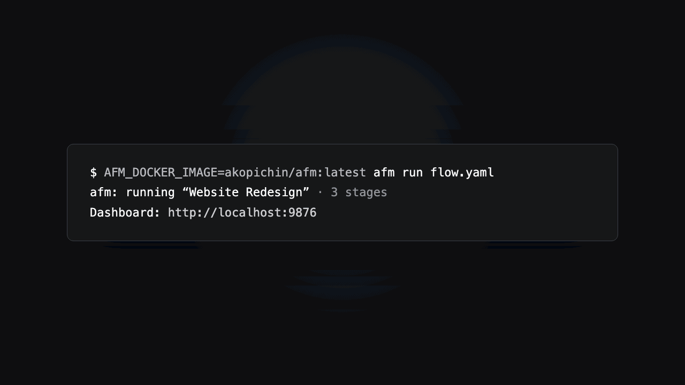

# afm

**A control plane for AI workflows that need to finish.** Coordinate multiple agents
across long-running stages, keep humans in the loop when judgment is needed, and make
every run observable, resumable, and recoverable from failure.

Use Claude, Codex, GLM, DeepSeek, Cursor, or other compatible agents — together in the
same workflow.

[](https://github.com/akopichin/afm/actions/workflows/ci.yml)
[](https://github.com/akopichin/afm/releases)
[](https://goreportcard.com/report/github.com/akopichin/afm)
[](LICENSE)
[](https://akopichin.github.io/afm/)

<p align="center">
  
</p>

## Why afm, when Claude Code already exists

- **Tasks measured in hours, not minutes.** Every run is written to an append-only
  event log; if it's interrupted, `afm run` resumes from the same point — completed
  stages are skipped, interrupted ones retried.
- **Several models in one flow.** Claude plans, a cheaper model (GLM/DeepSeek) does
  the routine work, another reviews — each stage can use a different agent.
- **A human in the loop at the plan level.** Review and comment on the plan
  line-by-line *before* any code is written, like a merge request.
- **An explicit dependency graph and artifacts** between stages, instead of implicit
  shared context.
- **Everything on disk** — logs, events, and (with `--debug`) the exact prompt each
  agent received. You can see what happened after the fact.

## Quick start

```bash
brew install --cask akopichin/afm/afm   # or see the install guide for Linux/Docker/source
afm init                                # scaffold a flow into .afm/flows/ interactively
afm run                                 # run the flow from .afm/flows (or: afm run path/to/flow.yaml)
```

A live dashboard comes up at `http://localhost:9876` (its URL is printed to the log).

After the planning phase each stage waits at `awaiting_approval` — review and approve
the plan in the dashboard, and afm implements it. Follow along with `afm check` or the
dashboard. (The CLI `afm approve`/`revise`/`retry` commands are for headless use — a
live `afm run` holds an exclusive lock, so approve through the dashboard while it's
running.)

## A minimal flow.yaml

```yaml
name: my-feature
description: "Add JWT auth"

stages:
  - id: backend
    name: "Backend API"
    description: "Implement the login/logout endpoints and JWT middleware."
    agents: [planning, implementation, review]
    artifacts:
      - name: api-contract
        path: docs/api-contract.yaml
        description: "OpenAPI specification"

  - id: frontend
    name: "Frontend"
    description: "Build the login UI against the API contract."
    agents: [planning, implementation]
    depends_on: [backend]
    inputs:
      - backend.api-contract
```

See more in [`examples/`](examples/), and every field in the
[flow.yaml reference](https://akopichin.github.io/afm/flow-reference/).

## Documentation

Full documentation lives at **[akopichin.github.io/afm](https://akopichin.github.io/afm/)**:

| Topic | |
|-------|--|
| Install, first flow, approving plans | [Getting started](https://akopichin.github.io/afm/getting-started/) |
| Every `flow.yaml` field | [flow.yaml reference](https://akopichin.github.io/afm/flow-reference/) |
| `config.yaml`, `--dir`, `--debug` | [Configuration](https://akopichin.github.io/afm/config-reference/) |
| Statuses and resume | [Stage lifecycle](https://akopichin.github.io/afm/stage-lifecycle/) |
| `agents: [auto]` | [Autonomous track](https://akopichin.github.io/afm/autonomous-track/) |
| File-based dialog | [Interactive stages](https://akopichin.github.io/afm/interactive-stages/) |
| Event notifications, secrets in hooks | [Lifecycle hooks](https://akopichin.github.io/afm/lifecycle-hooks/) |
| Carrying lessons across runs | [Agent memory](https://akopichin.github.io/afm/agent-memory/) |
| Token/cost tracking, `pricing:` overrides | [Cost accounting](https://akopichin.github.io/afm/accounting/) |
| The web dashboard | [Dashboard](https://akopichin.github.io/afm/dashboard/) |
| Running in Docker, non-Claude agents | [Docker mode](https://akopichin.github.io/afm/docker/) |
| Event log, directory layout, prompts | [Internals](https://akopichin.github.io/afm/internals/directory-layout/) |

## Development

Once after cloning, enable the pre-commit hook (lint + build + test before every
commit):

```bash
git config core.hooksPath .githooks
```

The hook is versioned in `.githooks/pre-commit`, but `core.hooksPath` is local git
config, so it must be set in each clone. Skip it once with `git commit --no-verify`.

```bash
make build        # build (bin/afm)
make test         # tests (with -race)
make lint         # linter
make install      # go install
make docker-build # build the Docker image
```

Versioned release: `make release-patch` / `release-minor` / `release-major` bumps the
SemVer tag and pushes it; the actual build (Docker image + binaries + GitHub Release +
Homebrew cask) happens in GitHub Actions once the tag is pushed. A push to `main`
releases a patch version automatically. See the [CHANGELOG](CHANGELOG.md) for release
history and [CONTRIBUTING](CONTRIBUTING.md) to get started.

## License

[MIT](LICENSE).
